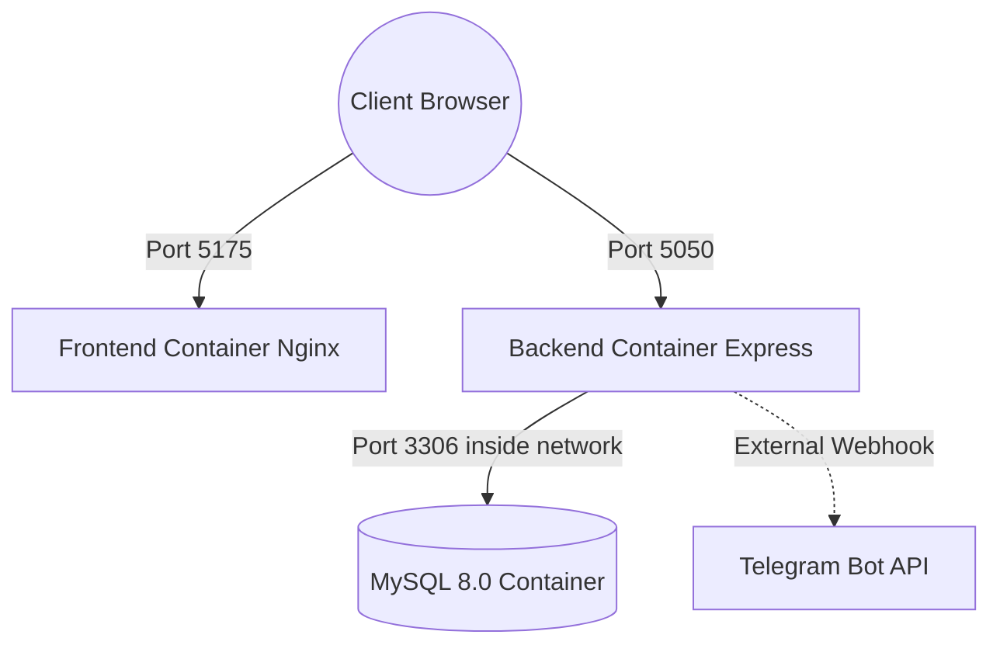

# System Architecture — Manivtha CRM

This document describes the design architecture, container organization, and operational guidelines for the Manivtha Tours & Travels Customer Booking CRM.

---

## 1. Component Topology

The system is deployed using a multi-container Docker Compose architecture:

1.  **Database Container (`db`)**: Runs MySQL 8.0. Mounts a Docker volume (`crm_db_data`) for persistent data retention. It maps internal port `3306` to port `3307` on the host to avoid conflicting with any local MySQL service.
2.  **API Backend Container (`backend`)**: Runs Node.js + Express. Houses controllers, routes, configurations, and services. Connects to the database container using internal hostname `db` and port `3306`. Exposes port `5050` to the host.
3.  **Client Frontend Container (`frontend`)**: Multi-stage compiled Vite + React build. Packaged and served via Nginx. It maps internal port `80` to port `5175` on the host.

---

## 2. Technical Stack

*   **Database**: MySQL 8.0 (InnoDB engine, relational integrity constraints).
*   **Backend**: Node.js v20, Express, `mysql2` pool connections, `bcryptjs` (password hashing), `jsonwebtoken` (auth credentials), and `express-validator` (sanitizations).
*   **Frontend**: React 18, React Router v6, Axios (with authorization interceptors), Lucide React (vector iconography), and Tailwind CSS v3 (styling tokens).

---

## 3. Dynamic Business Rules

### A. Lead Temperature Prioritization
Enquiries are dynamically classified on the backend using the following criteria:

*   **🔥 Hot Lead**:
    *   Travel date is within **3 days** AND status is `New`/`Contacted`.
    *   OR source is `WhatsApp`/`Phone Call` AND travel date is within **7 days**.
    *   OR passenger count is **8 or more** (large group booking).
*   **☀️ Warm Lead**:
    *   Travel date is within **4 to 14 days**.
    *   OR source is `Reference` AND travel date is within **30 days**.
    *   OR status is `Contacted` AND notes are saved.
*   **❄️ Cold Lead**:
    *   All other active requests.
    *   All cancelled or completed enquiries.
    *   Any requests where the travel date is in the past.

### B. Auto Invoice Generation
When an enquiry status becomes `Confirmed` via booking creation:
*   A booking record is created logging vehicle types, driver phone numbers, and pickup timings.
*   A serialized reference `INV-YYYY-MM-XXXX` is dynamically created where `XXXX` is the booking ID padded with zeros.
*   A printable route `/dashboard/bookings/:id/invoice` is exposed using `@media print` CSS configurations to produce print/PDF sheets without sidebar panels or navigational elements.
